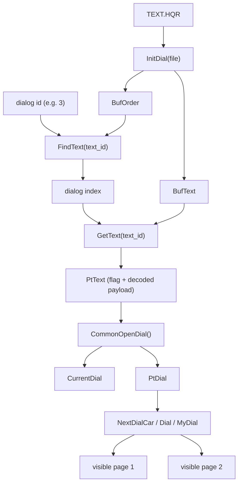

# Room 36 Dialog Decode

This note preserves the checked-in proof lane for the `36/36` Sendell dialog decoder work so future sessions do not restart from screenshots or `CurrentDial` alone.

## Scope

This note started as the room-`36/36` Sendell proof lane. As of `2026-04-20`, the same `PtText`/`PtDial` pattern has also been live-proved on the `newgame.LBA` Dino-Fly warning dialog, so the checked-in rule now applies to at least this class of two-page decoded dialogs:

- one stable decoded record anchor (`PtText`)
- one stable record identity (`CurrentDial`)
- one moving next-page cursor (`PtDial`)

It is still **not** proof of a finished generic classic dialog renderer.

## What We Proved

- Visible room-36 page 1 and page 2 are **not** distinct settled dialog payloads.
- Stable page-turn probes kept these values unchanged between visible page 1 and visible page 2:
  - `CurrentDial`
  - `TypeAnswer`
  - `Value`
  - `PtrPrg`
  - the sampled `CurrentDial` neighborhood cluster
  - the sampled `PtrPrg` target buffer
- A live process memory scan found the already-decoded English text in memory as one readable string:

```text
You just found Sendell's Ball. Now you have reached a new level of magic: Red Ball. It will also enable Sendell to contact you in case of danger.
```

- That means the visible page break is **renderer pagination inside one decoded text record**, not a durable dialog-id transition.
- The pinned decoder globals also survive live page-turn verification:
  - `CurrentDial` stayed `3 -> 3`
  - `PtText` stayed fixed
  - `PtDial` advanced from `PtText + 104` to `PtText + 145`
  - the decoded text record stayed identical
- A second live seam now matches that same model on `newgame.LBA`:
  - `CurrentDial` stayed `0 -> 0`
  - `PtText` stayed fixed
  - `PtDial` advanced from `PtText + 101` to the record terminator
  - visible page 1 ended before `"garden and looks injured."`

That means the current room-36 model is now stronger than before:

- `PtText` is the stable decoded-record anchor
- `CurrentDial` is the stable record identity
- `PtDial` is moving renderer cursor/state
- On visible page 1, `PtDial` already points at the start of the second-page sentence (`"Sendell to contact you in case of danger."`), so it behaves like a next-unread / next-page cursor, not the current visible-page start.
- On visible page 2, `PtDial` reaches the record terminator and then the following packed text bytes.

## Decode Path

Classic source anchor: `reference/lba2-classic/SOURCES/MESSAGE.CPP`

Observed decode flow:

1. `InitDial(file)` loads two `TEXT.HQR` resources:
   - `BufOrder`
   - `BufText`
2. `FindText(text_id)` scans `BufOrder` to map dialog id to an index.
3. `GetText(text_id)` uses that index to locate the decoded dialog payload inside `BufText`.
4. `CommonOpenDial()` sets `CurrentDial` and points `PtDial` at the decoded payload.
5. `NextDialCar()` / `Dial()` / `MyDial()` paginate and render that payload into visible dialog pages.

Important rendering rules in the payload stream:

- `0x00` ends the text
- `0x01` forces a newline
- `@P` is an explicit page-break token
- otherwise the renderer word-wraps the decoded text into pages

## Pinned Classic Globals

The static headless Ghidra pass now pins the main room-36 dialog globals used by `InitDial()`, `GetText()`, and `CommonOpenDial()`:

- `BufOrder = 0x004CC4A0`
  - loaded by `FUN_00431B98`
  - scanned by `FUN_00431A28` and `FUN_004322A4`
- `BufText = 0x004CC494`
  - loaded by `FUN_00431B98`
  - offset table and payload base used by `FUN_004322A4`
- `PtText = 0x004CC498`
  - set by `FUN_004322A4`
  - points to the decoded payload after the leading `FlagDial` byte
- `SizeText = 0x004CC49C`
  - set by `FUN_004322A4`
- `PtDial = 0x004CCDF0`
  - initialized from `PtText` by `FUN_0043322C`
  - consumed and advanced by `FUN_00432814`
- `CurrentDial = 0x004CCF10`
  - initialized by `FUN_0043322C`

Those functions line up with the classic source roles closely enough to treat the mapping as the canonical room-36 decoder lane:

- `FUN_00431B98` -> `InitDial(file)`
- `FUN_00431A28` -> `FindText(text_id)` plus streaming/speech setup
- `FUN_004322A4` -> `GetText(text_id)`
- `FUN_0043322C` -> `CommonOpenDial(text)`
- `FUN_00432814` -> page/line assembly over `PtDial`

## Diagram



## Why The Earlier Room-36 Model Is Stale

The earlier bounded port/runtime lane treated room `36/36` as a coarse dialog-id sequence:

- `513`
- `514`
- `287`

That is no longer a safe interpretation for the visible first and second Sendell pages.

Current proof says:

- visible page 1 and visible page 2 belong to one decoded text record
- the page turn is renderer-owned pagination
- the pinned decoder `CurrentDial` stays `3` across both visible pages
- the earlier `0x00475630 = 513` read is stale pager-side evidence, not the decoder `CurrentDial` global

`287` may still belong to a later semantic step; the point is that **visible page 2 should not be assumed to mean “dialog id 514” without new proof**.

## Preserved Tooling

Checked-in helpers:

- `tools/life_trace/dialog_text_scan.py`
- `tools/life_trace/dialog_text_dump.py`

Purpose:

- attach to a live `LBA2.EXE`
- scan readable memory for decoded dialog text
- preserve the runtime-memory proof that decoded text exists independently from `PtrPrg`
- dump the pinned decoder globals, decoded text record, and `PtDial` cursor state
- emit the generic next-page split:
  - `text_before_cursor`
  - `text_from_cursor`
  - whether the cursor currently marks a next-page boundary

Example:

```powershell
py -3 .\tools\life_trace\dialog_text_scan.py --substring Sendell
py -3 .\tools\life_trace\dialog_text_dump.py --process-name LBA2.EXE
```

## What To Build Next

The next clean step is a real runtime dialog paginator that reads:

- `CurrentDial`
- `BufOrder`
- `BufText`
- `PtText`
- `PtDial`

and emits:

- the visible page split as the classic renderer sees it

The remaining proof step is mapping the visible page boundaries to renderer behavior. `PtDial` clearly moves with the page turn, but the live dumps say it is a next-unread cursor, not the visible page start by itself.

## Current Port Consequence

The bounded port correction should be read narrowly:

- keep dialog id `513` across both visible Sendell pages
- keep dialog id `3` across both visible Sendell pages
- represent the visible page turn with the proved seam-local split
- do not use `514` as the visible second-page id

That is a seam-local runtime fix for the now-proved pagination behavior, not a finished dialog subsystem.

Until that exists, the current checked-in proof should be treated as:

- enough to stop using `513 -> 514` as the visible page model
- enough to anchor future decoder work
- enough to justify a reusable next-page cursor split helper for proved two-page seams
- not yet a finished generic in-game paginator
