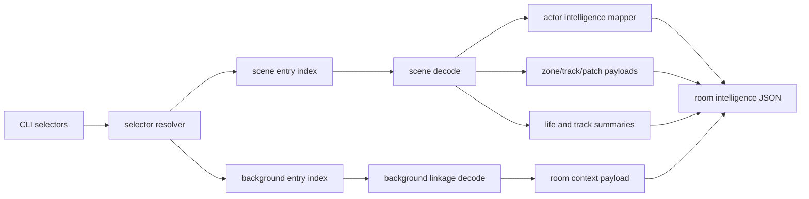

# Room Intelligence Architecture

## Purpose

`inspect-room-intelligence` is a higher-level inspection layer over the existing room and scene decode pipeline. It should give programs one stable JSON payload that combines scene structure, room context, actor data, and script-linked intelligence without requiring the caller to stitch together multiple lower-level commands.

## Current State vs Target State

Current state:

- `inspect-scene` exposes typed scene metadata and raw object fields.
- `inspect-room` exposes scene plus background linkage.
- `inspect-life-program` and `inspect-life-catalog` expose life decoding separately.
- Friendly room naming is not yet a first-class CLI selector for inspection.

Target state:

- A new `inspect-room-intelligence` command composes those existing surfaces.
- Programs can address rooms by entry index or friendly name.
- Actor intelligence becomes a first-class stable JSON section with raw and mapped fields.

## Module Boundaries

- `port/src/tools/cli.zig`
  Owns command parsing, selector validation, and JSON emission entrypoints.
- `port/src/game_data/scene.zig` and `port/src/game_data/scene/*`
  Own typed scene decode, object fields, track decode, zone semantics, and life-program decoding primitives.
- `port/src/runtime/room_state.zig`
  Owns room-level scene/background composition used by existing room inspection.
- Metadata lookup layer
  Planned small helper that resolves friendly scene/background names from preserved metadata files.

## Data Flow

## Intelligence Model

The intelligence layer must preserve raw truth first and add mapped meaning second.

Each actor record is organized as:

- `raw`: exact decoded fields from the current `SceneObject`
- `mapped`: grouped interpretations such as position, render source, movement, combat, and bit breakdowns
- `track`: raw bytes plus decoded instructions
- `life`: raw bytes plus decode status and instruction summaries

This keeps the surface useful both for machine consumers and for future semantic expansion.

## Non-Negotiable Constraints

- Do not reparse scene blobs in parallel with the existing decoders.
- Do not change the JSON contract of `inspect-scene` or `inspect-room` in place.
- Do not claim undocumented flag names unless they are grounded in repo evidence.
- Do not rely on Builder UI state or automation; this project is data-first and CLI-first.

